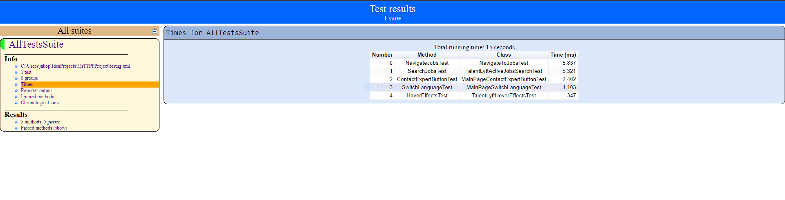

#MiTTPP Project

This project was done as a part of college course.
It uses https://factory.dev website to test on using Selenium Webdriver.

##Used in project:
1. Wait inside selenium webdriver
2. Page Object Model
3. .gitignore 
4. README.md
5. OOP
6. Reporting

##Example of report file:

